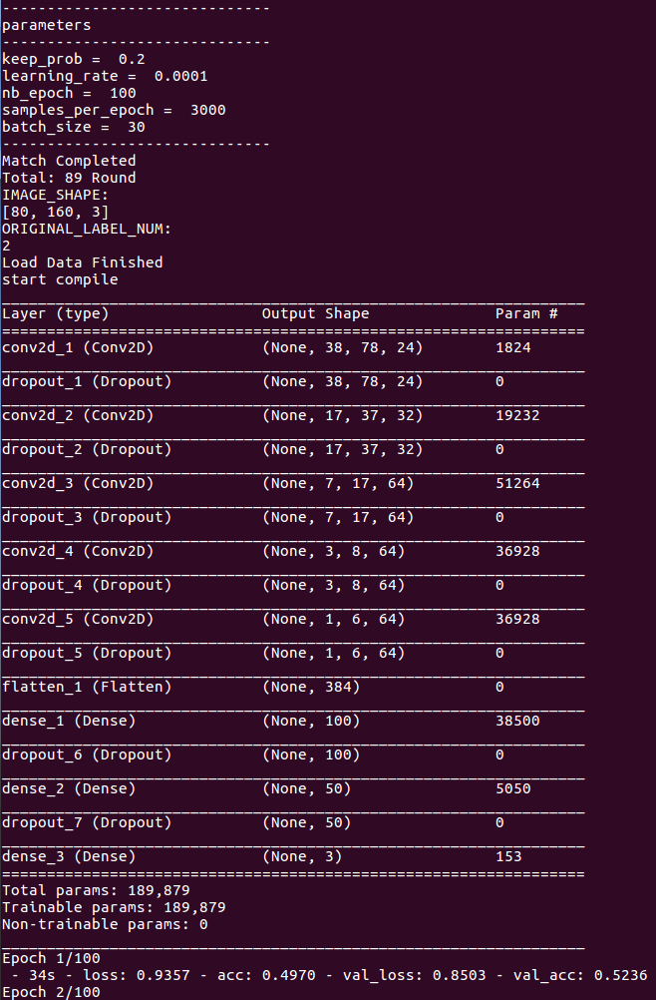

<!--
 * @Author: Sauron Wu
 * @GitHub: wutianze
 * @Email: 1369130123qq@gmail.com
 * @Date: 2019-10-15 15:51:43
 * @LastEditors: Please set LastEditors
 * @LastEditTime: 2019-10-30 17:50:55
 * @Description: 
 -->
# What you will learn
- How to do some pre-process in your images.
- How to train the AI model.

# Preparation
Please run `pip install keras==2.2.0` to install keras if you want to use the code we provided.

# Handle images
1. First copy the images your generated(using the images from the car's collect function or from the simulator or from anywhere) to the Host-Part/images directory. If you want to use our simulator to generate images, please go to sdsandbox and read its guide.
2. Run `python process_img.py --path=./images --store=./training_data_npz --method=0`, process_img reads images from path and store the result in store.
3. Read the file `process_img.py` and what you need to edit is the function `image_handle()`, you can do anything you want to the images in the function. If you change the image size in `image_handle()`, you need to reset the `IMAGE_SHAPE` in `main()`.
4. If the `--method` parameter equals 0, it means that you want to ignore some training data(ex. data of one category is too much and you want to make a balance), you can define your own tactic in the `main()` in `process_img.py`.  

   
# Train the model
1. Run `python train.py --model=./model_stored --read=./training_data_npz`, it will use the processed images from process_img's result and store the trained model in model_stored directory.  

2. You should set the `OUTPUT_NUM` which means the number of labels. The IMAGE_SHAPE will be set automatically.
3. You can define your own network structure in `build_model()` and your own compiling features in `train_model()`. Also all the variables in it can be set as you wish but I recommend you read the code carefully and think twice before you edit. If you want to do some changes to labels, you should edit `batch_generator()`, you can read the original data stored in train.csv and build your own labels. 

# Steps
- Just one single step: Run `./process_train.sh`, you can edit the script to change read/store directories. 
- Now, here comes two methods for you to choose, one is to use the real car to run and test, the other is to use our simulator to test. For more information of the simulator, please refer to `Virtual-Part` guides.
