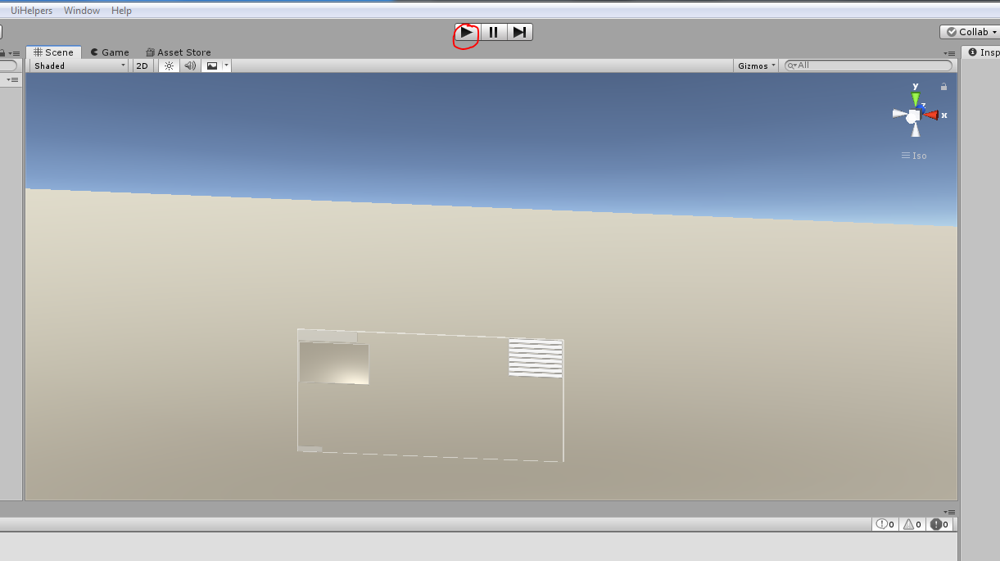
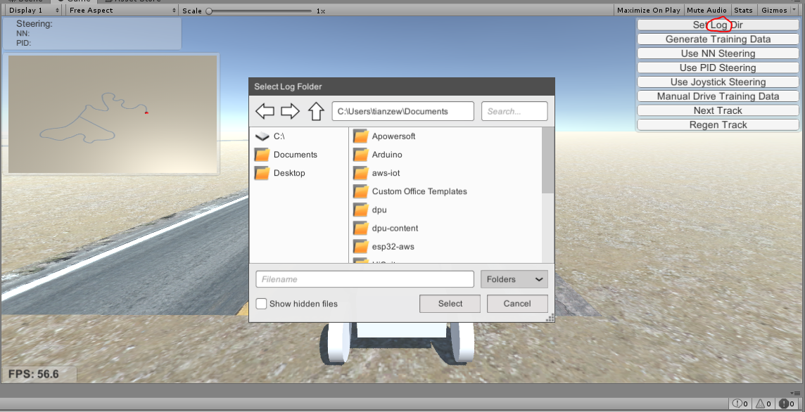
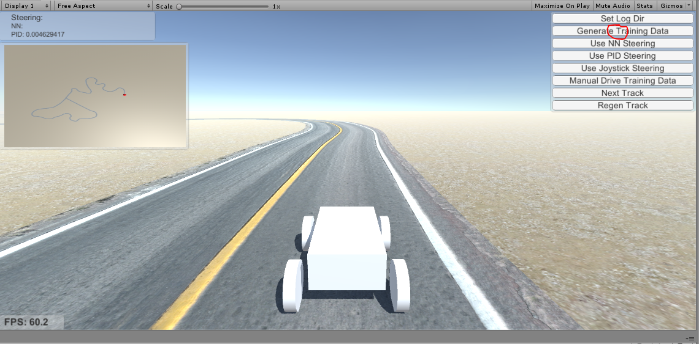
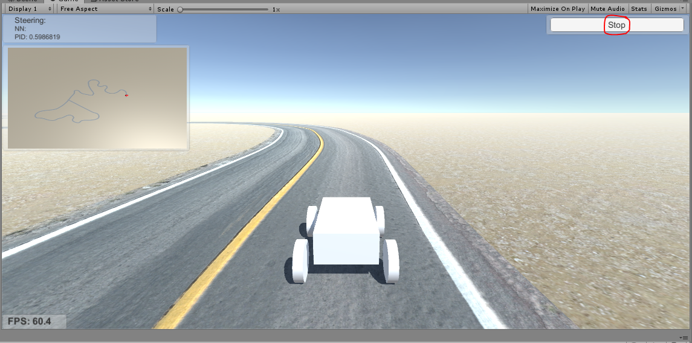
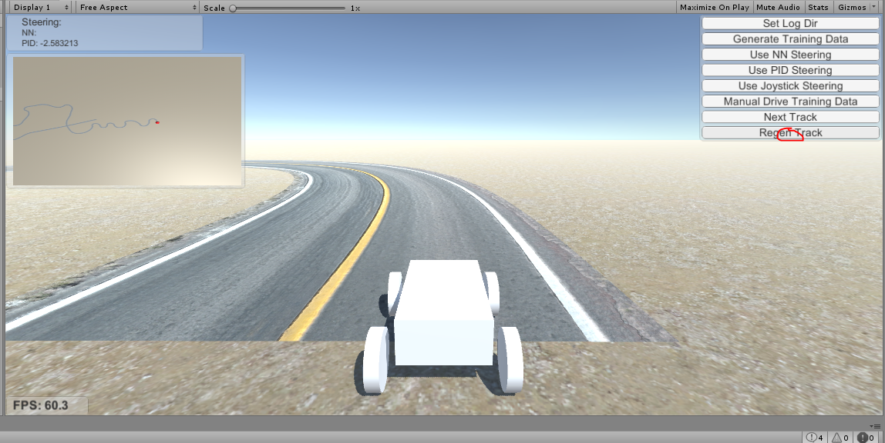

<!--
 * @Author: Sauron Wu
 * @GitHub: wutianze
 * @Email: 1369130123qq@gmail.com
 * @Date: 2019-09-23 10:12:28
 * @LastEditors  : Sauron Wu
 * @LastEditTime : 2020-01-10 11:45:10
 * @Description: 
 -->
# Introduction
The simulator we provided is based on the sdsandbox project. For more information about the initial project, please refer to [this](https://github.com/tawnkramer/sdsandbox). 

# What you can do with the simulator
- Collect training data
- Test your model or algorithms in the virtual world
- Play computer games only(not recommend)

## Setup

You need to have [Unity](https://unity3d.com/get-unity/download) installed, and python3+, tensorflow, keras is also needed.

You can both use linux version or windows version of Unity3d. 

## Using Unity3d to test your .h5 model

1) Start the prediction server with the pre-trained model. 

```bash
cd Virtual-Part
python src/predict_server.py --model=path-to-your-model/model.h5
```
 If you get a crash loading this model, you will not be able to run the demo. But you can still generate your own model. This is a problem between tensorflow/keras versions. 
 
2) Load the Unity project Virtual-Part/simulator in Unity. Double click on Assets/Scenes/main to open that scene.  

3) Hit the start button to launch. Then "Use NN Steering". 

## Build Your Own Road
- S n
    This means to build straight road for n length.
- DY n
    This means the road will curve, the bigger n means bigger angle.
- L n
    This always follows DY, means build road with the pre-set angle by DY, and the road will turn left, n is the length.
- R n
    Like L, this means to turn right.
- BLOCK, CONE
    This will add a block/cone in the road.

## Generate training data

1) Load the Unity project Virtual-Part/simulator in Unity.  
  

2) Hit the start arrow in Unity to launch project.  


3) Select `Set Log Dir` to choose the directory where you want to store the generated data.


4) Hit button "Generate Training Data" to generate image and steering training data. See the directory for output files. 
 

5) When the road comes to an end, just stop the generating process and generate another road, then start the process again.



6) The default pictures to collect is 50000, the guide will teach you how to change it later.

## If you want to make some changes to the simulator, please read custom_simulator.md.


